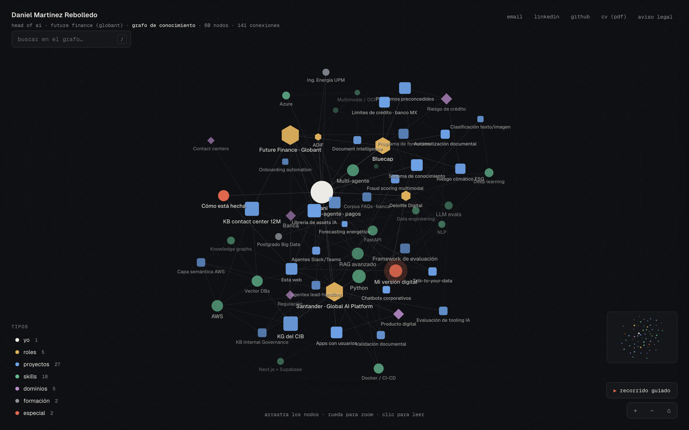
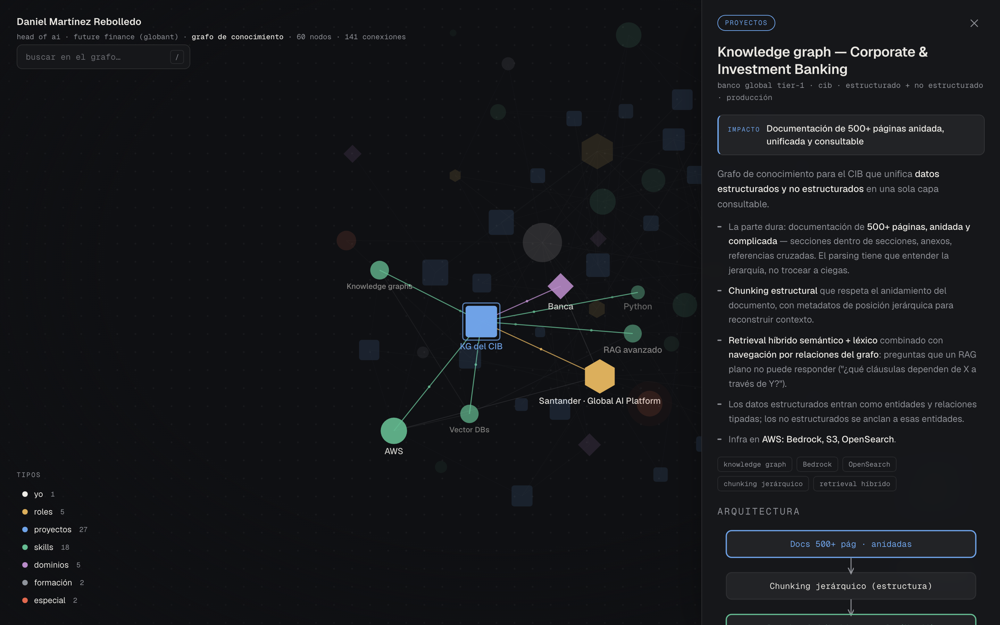

<div align="center">

# talktomycv

**A résumé you can explore — and talk to.**

An interactive knowledge graph of a career, rendered on a hand-written 2D physics engine, with a real AI agent that answers as its owner — cost of every conversation shown live.

[**▶ Live demo**](https://talktomycv.vercel.app) · [Download CV (PDF)](https://talktomycv.vercel.app/cv.pdf)



   

</div>

---

## What is this?

Most CVs are a flat list. This one is a **graph**: every role, project, skill and domain is a typed node, connected by relationships that actually mean something — the same modelling principles used to build real knowledge bases. You can explore it freely, follow a guided tour, or ask **the digital version of me** — an agent running on the Claude API that answers only with verifiable facts, refuses to make things up, and shows the token cost of every message.

It's a portfolio piece that *is* the skill it's advertising.

## Features

- 🕸️ **Custom force-directed graph** — repulsion, springs, gravity and ambient drift, on a 2D `<canvas>`. No D3, no libraries. ~60 nodes, ~140 edges, shape-coded by type.
- 🤖 **A real AI agent, not a chatbot toy** — streaming responses over the Claude API, with a qualification gate, a per-session budget, prompt caching, and **live cost telemetry** ("this conversation costs me €0.00x").
- 🎯 **Honest fit-check** — paste a job description and the agent maps strong fit / partial fit / honest gaps, then suggests interview questions.
- 🔒 **Production-grade guardrails** — anti prompt-injection, per-email & per-IP rate limiting, a daily spend kill-switch, deny-all row-level security, and GDPR-compliant consent + retention.
- 🔗 **Deep-linkable** — every node has its own URL (`/#kbcib`), so any part of the graph is shareable.
- ⚡ **No build, no framework** — a single self-contained `index.html` for the front end; the back end is a handful of dependency-free Vercel Edge Functions.

<div align="center">

</div>

## How it works

**The graph** (`index.html`) is one self-contained file. A small physics loop integrates repulsion (O(n²)), Hooke-law springs with per-degree rest length, gravity toward the centre and a per-node ambient drift, then renders everything on a canvas with staggered node entry and an animated camera. Search, guided tour, minimap and per-node deep-links sit on top.

**The agent** (`api/`) runs on Vercel Edge Functions with zero dependencies:

| Endpoint | Role |
|---|---|
| `api/gate.js` | Qualification gate — validates the recruiter, enforces rate limits (3/day per email, 6 per IP), checks the daily spend cap, mints a session token. |
| `api/chat.js` | Streams the Claude response (SSE), injects the recruiter context as *untrusted data*, enforces a per-session token budget, and atomically books the spend. |
| `api/admin.js` | Token-gated read-only dashboard API over the stored sessions. |
| `api/_prompt.js` | The full system prompt — persona, facts, and guardrails. Nothing is hidden. |

**Data** lives in Supabase (Postgres, EU region) under **deny-all RLS** — the service role is the only path in, and a scheduled function purges everything older than 12 months. See [`schema.sql`](schema.sql).

## Security & privacy

This started as a red-team exercise against itself. What's in place:

- **Anti prompt-injection** — recruiter-supplied fields are sanitised and framed as *data, not instructions*; the system prompt is hardened against prompt-leak and role-play jailbreaks.
- **Abuse & cost control** — per-email/per-IP rate limiting, a per-session token budget, and an **atomic** daily spend kill-switch (no lost-update race).
- **Row-level security** — every table is deny-all; nothing is reachable with the public key.
- **GDPR** — explicit consent with timestamp, a privacy policy naming every processor and the US transfer, full data-subject rights, and automatic 12-month retention.
- **AI Act transparency** — the agent identifies itself as AI.
- **No secrets in the repo** — every key is an environment variable; history is clean.

## Tech stack

`Vanilla JS` · `HTML Canvas` · `Vercel Edge Functions` · `Supabase (Postgres + RLS)` · `Claude API (Haiku + Sonnet)` · **no framework, no build step, zero runtime dependencies**

## Run your own

```bash
git clone https://github.com/Danimr96/talktomycv
cd talktomycv
```

1. Create a Supabase project and run [`schema.sql`](schema.sql).
2. Set the environment variables (in Vercel or `.env`):
   ```
   ANTHROPIC_API_KEY          # your Claude API key
   SUPABASE_URL               # your project URL
   SUPABASE_SERVICE_ROLE_KEY  # server-side only
   IP_SALT                    # any random string, for IP hashing
   ADMIN_TOKEN                # 20+ char secret for /admin.html
   DAILY_CAP_EUR=2            # daily spend kill-switch
   SALARY_FLOOR=0             # optional
   ```
3. Deploy to Vercel. That's it — no build step.

Then replace the graph data (the `N` and `E` arrays in `index.html`) and the system prompt (`api/_prompt.js`) with your own, and you have **your** CV as a knowledge graph.

## Project structure

```
index.html        # the entire front end: graph engine + agent UI
admin.html        # private, token-gated telemetry dashboard
api/
  gate.js         # qualification gate + rate limiting
  chat.js         # streaming agent + budget enforcement
  admin.js        # dashboard API
  _prompt.js      # system prompt (persona + guardrails)
  _shared.js      # Supabase fetch, pricing, helpers
schema.sql        # Postgres schema + RLS + retention
vercel.json       # security headers (CSP, HSTS, X-Frame-Options…)
```

## License

Code is [MIT](LICENSE) — fork it, build your own, no permission needed.

**Personal content is not.** The résumé data, project descriptions, the persona and copy in `index.html` / `api/_prompt.js`, `cv.pdf` and `og.png` are © Daniel Martínez Rebolledo and describe a real person — please don't reuse them. Swap in your own.

---

<div align="center">
Built with <a href="https://claude.com/claude-code">Claude Code</a>. If you build your own, ⭐ this repo and send me the link.
</div>
